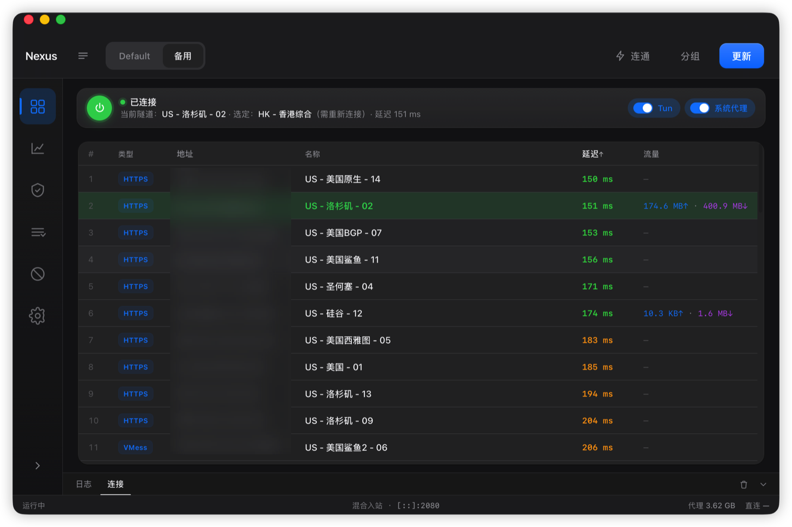

# Nexus

macOS VPN / proxy client. GUI: Qt Quick (`app/qt`). Engine: Go core (**sing-box**) + framed IPC.

> Nexus ships sing-box only. It does not bundle Xray Core. VLESS inputs that need
> Xray (`type=xhttp`, an `encryption` other than `none`, or `extra=`) are reported
> as unsupported during import instead of being accepted and failing at connect.



| Item | Value |
|------|--------|
| Product | Nexus |
| Version | 0.2.3 |
| Bundle ID | `app.nexus.desktop` |
| Core binary | `NexusCore` (framed IPC) |
| Socket env | `NEXUS_CORE_SOCKET` / `NEXUS_CORE_DEBUG` |

## Platforms

| Target | Arch | Shell / install | Core |
|--------|------|-----------------|------|
| macOS 13+ | arm64 | self-contained `.app` | `NexusCore` (CGO) |

Nexus does not ship non-macOS targets. Historical HTML GUI and platform pack
scripts live under [`archive/`](archive/) and are excluded from the product build.

### Data directories

| OS | Data | Core log |
|----|------|----------|
| macOS | `~/Library/Application Support/Nexus` | `~/Library/Logs/Nexus/core.log` |

The data and log directories are chmodded to `0700`: Core logs every outbound destination at
`info`, so the log and sing-box's `cache.db` beside it are a record of where the
traffic went. `core.log` rolls to `core.log.1` past 16 MB at spawn. The macOS
firewall daemon logs separately to `/var/log/nexusfwd.log`, created `0600` at
install and removed on uninstall.

## Layout

- `app/qt/` — Qt Quick GUI (C++ host + QML)
- `app/backend/` — Rust backend + JSON C ABI (`nexus_invoke`) linked by the Qt host
- `app/backend/src/core/` — framed IPC + Core session lifecycle
- `app/backend/src/data/` — JSON store + pure configuration generation
- `app/backend/src/sys.rs` — macOS system proxy integration
- `app/assets/icons/` — application and tray icon assets
- `core/server/` — Go core (`module NexusCore`, **GPLv3** combined work)
- `licenses/` — full GPLv3 / MPL-2.0 texts
- `THIRD_PARTY_NOTICES.md` — third-party inventory
- `archive/` — former HTML GUI and Windows pack scripts (not built)
- `bin/` — build outputs (gitignored)

## License

**Multi-license (Plan A).** Not a single proprietary blanket.

| Part | Terms |
|------|--------|
| **NexusCore** (`core/server`, `NexusCore` binary) | **GPLv3+** — see [`core/server/LICENSE`](core/server/LICENSE), [`licenses/GPL-3.0.txt`](licenses/GPL-3.0.txt) |
| **Shell / original product code** (`app/`, …) | Nexus original terms in root [`LICENSE`](LICENSE), with carve-outs for GPL/MPL rights |
| **Third-party** | [`THIRD_PARTY_NOTICES.md`](THIRD_PARTY_NOTICES.md) |

Distributing an app that embeds NexusCore requires GPLv3 compliance for Core,
including Corresponding Source for that build. Other third-party terms are
listed in `THIRD_PARTY_NOTICES.md`. This is an engineering layout, not legal advice.

## Build

### Full rebuild (macOS host)

```bash
./build.sh   # no flags — always full rebuild
```

Produces `bin/NexusCore` and `bin/Nexus.app` (Qt host).

Requires: macOS 13 or newer, Xcode CLT, `go`, `cargo`/`rustc`, `cmake`, `protoc`, and Qt 6.11.
Homebrew Qt is detected automatically; set `NEXUS_QT_HOME` for another Qt prefix.

The build embeds Nexus QML and tray assets, deploys the required Qt frameworks
and plugins, includes license notices, and verifies the resulting app bundle.
Without credentials it is ad-hoc signed for local testing. For a distributable
Developer ID build:

```bash
NEXUS_SIGN_IDENTITY="Developer ID Application: Example (TEAMID)" \
NEXUS_NOTARY_PROFILE="nexus-notary" \
./build.sh
```

`NEXUS_NOTARY_PROFILE` names credentials previously stored with
`xcrun notarytool store-credentials`. When supplied, the build submits, waits,
staples, and verifies the notarization ticket.

## Dev

```bash
export PATH="$HOME/.cargo/bin:$PATH"
./build.sh          # when you need a fresh Core + mac .app
cmake --build app/qt/build --target nexus && app/qt/build/nexus
```

## Capabilities (0.2.3)

- Connect: selected node → generate → Core `Start` (share link or outbound JSON)
- Tun chip + system proxy; exit clears OS proxy on `:2080` and stops Core
- Catalog (groups/nodes) in store via `catalog_get` / `catalog_put`
- Node **Traffic** column: Core `QueryStats` deltas accumulated **per node** (survives node switch / Tun re-Start; only Reset traffic zeros)
- Honest UI: tunnel ≠ selected shows mismatch; TCP probe labeled Connectivity (not a proxy-path test)
- **Runtime status** shows the exit IP and country as the far end sees them, fetched *through* the tunnel — a direct lookup would report this machine and be the wrong answer stated confidently. Blank when the tunnel cannot carry it.
- **Import** parses share links for vless / vmess / trojan / ss / socks / http(s) / anytls / tuic / hysteria / hysteria2, and Clash YAML for the same set. Entries it cannot use are reported by protocol instead of silently lowering the count — including `vless-xray` for VLESS features not supported by the bundled sing-box engine.
- **Idle-only actions:** the direct TCP probe binds the physical NIC, and uninstalling the firewall helper flushes the PF anchor. Both are refused unless the tunnel is fully disconnected. While connected, use the per-node URL test, which measures via the node.
- **Firewall (OS fail-closed, macOS only):** sidebar Firewall + **NexusFwD** LaunchDaemon (PF anchor `nexus`). Domain/process blocklist removed. Orthogonal to sing-box routing/Core/Tun/proxy. Install helper before connect.
- Connection table: merge by Core id, multi-select like nodes (copy), process + PID columns
- **i18n:** UI chrome + runtime log panel in `zh-CN` / `en` / `ru` / `zh-TW` (live language switch)
- Only implemented controls are shown. Subscription updates, DNS generation and
  imported per-node mux settings are wired; advanced routing, custom inbound and
  autostart controls are intentionally absent. The mixed inbound is fixed at
  `127.0.0.1:2080`.

## Status

Operational for **macOS arm64**. The build can produce an ad-hoc local artifact
or a Developer ID signed and notarized distribution artifact when credentials
are supplied.
